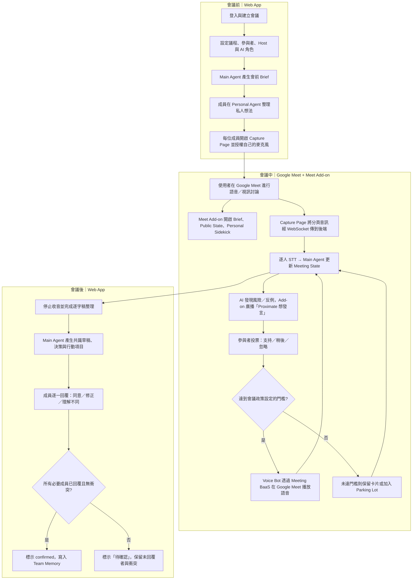
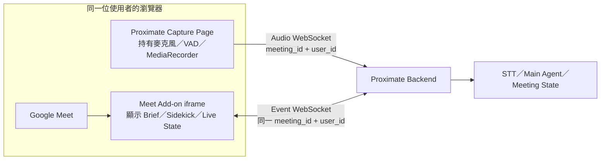
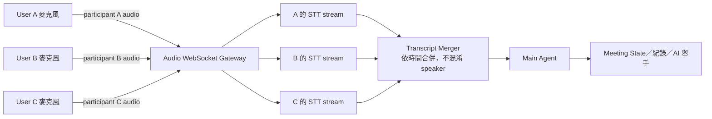
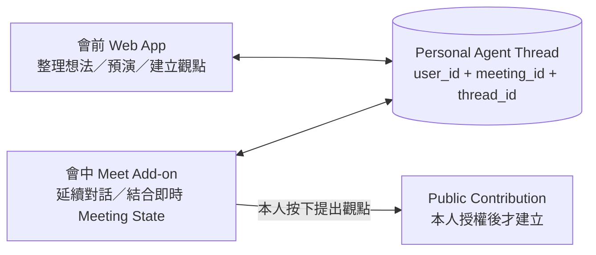
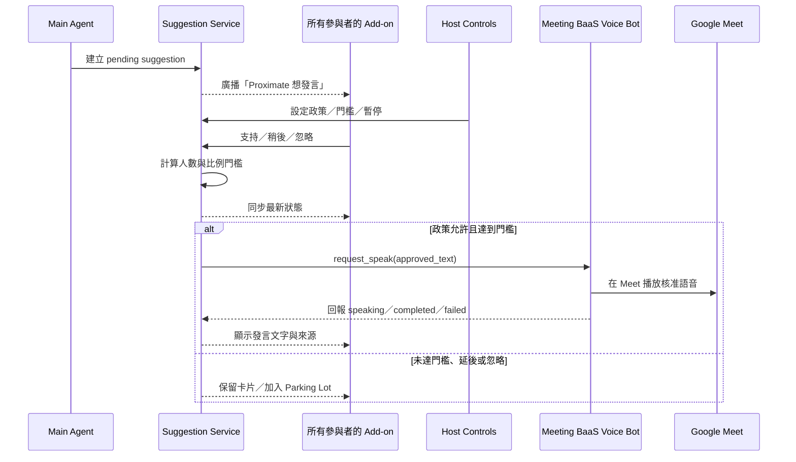
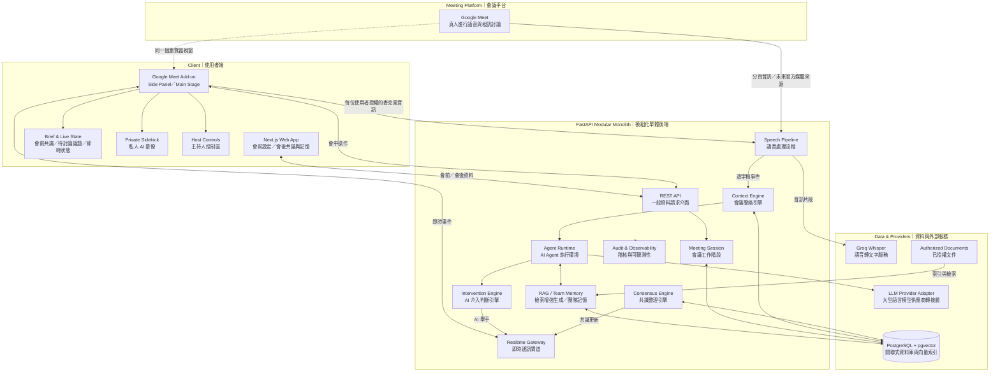

# Proximate

> **Not an AI note-taker. An AI teammate.**
> 
> 
> AI 不只記得團隊說了什麼，也協助找出還沒被說出口的觀點。
> 

Proximate 是一套以「AI 作為另一位組員」為核心的智慧會議協作系統。它從會前開始理解議程、成員想法與歷史決策，在會中協助團隊發現分歧、盲點、風險與反例，並在會後讓所有成員確認對決策與下一步的理解一致。

本專案目前處於 **黑客松產品定義與技術驗證階段**。Repository 內尚無可執行程式碼；本文件統整現有六份規劃文件，將產品定位、使用者流程、資訊架構、會中整合方案、MVP 範圍與預計技術架構整理為單一產品藍圖。

> [!IMPORTANT]
本文件中的頁面、路由、資料表與 API 是建議規格，不代表已完成實作。標示為「MVP」的項目是黑客松建議範圍；「後續」項目不應阻塞核心展示。
> 

## 目錄

- 產品摘要
- 問題與目標使用者
- 產品原則與範圍
- 核心使用者流程
- 資訊架構與 Web App 頁面
- 會中架構與產品邊界
- 功能規格
- AI 角色與介入機制
- 系統架構
- 技術選型
- 資料、API 與即時事件
- 安全、隱私與治理
- MVP、Demo 與成功指標
- 競品與差異化
- 執行疑慮、無法驗證項目與解法
- 風險與限制
- 預計專案結構
- 目前文件

## 產品摘要

### 一句話定位

**Proximate 是一套具備團隊記憶、即時思考與個人代理能力的 AI 會議協作系統，讓 AI 不只記錄會議，而是像真正的組員一樣，在會前準備、會中思考、會後確認共識。**

### 核心價值

傳統會議 AI 多半回答「會議發生了什麼」；Proximate 希望協助團隊回答：

- 這次真正需要決定什麼？
- 哪些人的想法尚未完整表達？
- 目前方案忽略了哪些風險、反例或歷史教訓？
- 團隊最後是否真的對決策與下一步有相同理解？

### 四項核心能力

| 能力 | 說明 | 對應價值 |
| --- | --- | --- |
| **AI Teammate** | 在重要決策形成時提出問題、反例、風險、歷史資訊與替代方案 | 提升決策品質，而非只提升紀錄效率 |
| **Personal Sidekick** | 每位成員擁有私密 AI 幕僚，把模糊想法整理成可討論的觀點 | 降低發言門檻，保留心理安全感 |
| **Team Memory** | 保存決策、理由、被否決方案與限制，並在未來討論中附來源取回 | 避免每次會議重新開始 |
| **AI Delegate** | 缺席者事前設定立場、限制與必須提醒條件，由 AI 代表提出 | 讓缺席不等於退出討論，但不讓 AI 擅自決策 |

### 名詞表

| 名詞 | 白話說明 |
| --- | --- |
| **Meet Add-on** | 嵌入 Google Meet 裡的 Proximate 面板，通常顯示在右側；使用者不用離開 Meet 就能查看 AI 資訊與操作功能。 |
| **Capture Page** | Web App 中專門負責收音的頁面。每位成員在這裡授權自己的麥克風，並維持音訊連線。 |
| **Main Agent** | 公開的會議主 Agent。負責理解整場會議、整理共用狀態、找出風險，並提出發言建議。 |
| **Personal Agent／Personal Sidekick** | 每位成員自己的私密小 Agent，協助整理思緒；未經本人授權，不會把私人內容公開。 |
| **Voice Bot** | 由 Meeting BaaS 管理、代表 Proximate 加入 Google Meet 的會議 Bot。Voice Bot 不會自行決定或修改發言內容；只有在會議允許 AI 發言，且參與者支持人數達到門檻後，後端才會要求它播放核准文字。 |
| **支持門檻** | 允許 Voice Bot 發言所需的同意條件。預設為至少 2 人且超過在線成員 50% 支持；Host 可以調整或暫停。 |

### 最重要的產品承諾

1. **Represent, not Decide**：AI 可以代表已授權的立場，但不能替人投票、承諾資源或做最終決定。
2. **Raise a hand, do not interrupt**：AI 先以舉手卡或想法泡泡提出候選觀點，由參與者決定是否展開。
3. **Private by default**：個人 Agent 的原始對話預設私密，只有本人明確按下「提出觀點」才公開整理後的版本。
4. **Consensus, not only Summary**：會後輸出不只摘要，也保留決策理由、未決問題、不同理解與成員確認狀態。
5. **Traceable, not authoritative by default**：AI 提醒須附來源與信心；推測不得直接變成已確認決策。

## 問題與目標使用者

### 要解決的問題

| 階段 | 使用者痛點 | Proximate 的回應 |
| --- | --- | --- |
| 會前 | 報告者面對零散資料，不知道如何整理議程與決策點 | 產生 Pre-meeting Brief：已有共識、分歧、未決問題與建議討論順序 |
| 會前 | 成員只有模糊疑慮，還沒有完整論點 | Personal Sidekick 追問並整理成觀點、理由、證據、風險與問題 |
| 會前 | 無法出席者的立場完全缺席 | 事先建立有範圍、有期限的 Delegate Profile |
| 會中 | 大量時間重複背景資訊，真正要決策的問題反而沒時間討論 | 即時維護目前議題、主要立場、未回答問題與暫定決策 |
| 會中 | 階級、時間壓力或表達困難使少數意見沒有被提出 | 私密整理後由本人授權公開，亦可考慮匿名呈現 |
| 會中 | 團隊快速同意，看不到反例、假設與歷史衝突 | AI 以紅隊或第三方思考者身分建立舉手卡 |
| 會中 | 容易離題、超時或形成沒有資源基礎的承諾 | 主持模式提示議程進度、偏題、缺漏條件與資源風險 |
| 會後 | 成員對「決定了什麼、為什麼」理解不同 | 產生可修正、可版本化、可逐人確認的 Consensus |
| 長期 | 過去的失敗方案與決策理由被遺忘 | 建立 Decision Memory 並在後續會議中檢索引用 |

### 主要使用者

| 角色 | 主要任務 | 權限邊界 |
| --- | --- | --- |
| **Host 主持人** | 負責本場會議的議程、AI 政策、門檻與緊急控制；可由團隊成員在會議設定時指定 | 不得讀取成員的私人 Agent 對話 |
| **Member 與會者** | 查看公共狀態、使用私人 Agent、授權公開觀點、確認共識 | 只能存取自己的私人資料 |
| **Absent Owner 缺席者** | 事前建立 Delegate 規則，會後查看與修正結果 | Delegate 只能使用預先授權內容 |
| **Team Admin 系統／團隊管理者** | 成員、整合、資料保留與稽核設定 | 預設不得查看私人對話正文 |

### 建議首波 Persona

黑客松應鎖定 **5–15 人、經常在線上討論產品或技術決策的跨職能團隊**，例如產品經理、設計師與工程師組成的小型產品團隊。這類團隊有明確決策、歷史脈絡與意見不對稱，最容易展示 Proximate 的差異化。

## 產品原則與範圍

### 黑客松產品假設

> 如果 AI 能在不打斷會議、也不洩漏私人想法的前提下，讓至少一個原本未被提出的關鍵風險進入討論，並在會後讓所有人確認同一份決策脈絡，團隊會感受到它是「組員」而非「筆記工具」。
> 

### MVP 必須完成

- 建立一場會議與基本議程。
- 以使用者授權的分頁音訊驅動逐字稿與 Meeting State；無法取得音訊時才使用預先準備的測試資料。
- Google Meet 作為首個會議平台；Voice Bot 須在會議政策允許且達到發言門檻後，透過 Meeting BaaS 播放繁體中文 TTS。
- 公共看板顯示議題、立場、未決問題、暫定決策與行動項目。
- AI 偵測一個未被考慮的風險，建立「AI 舉手」卡。
- 參與者可對 AI 觀點投票；達到門檻後 Voice Bot 發言，Host 可暫停、否決或讓議題稍後討論。
- 一位成員能在 Personal Sidekick 中把模糊想法整理後明確授權公開。
- 會末產生決策、理由、未決問題與行動項目，並讓成員確認或修正。

### MVP 明確不做

- 不同時支援 Google Meet、Zoom、Microsoft Teams。
- 不建立自主互聊的多 Agent swarm。
- 不讓 AI 未經會議政策與支持門檻直接語音插話。
- 不依賴高精度聲紋辨識；先用模擬角色、平台字幕名稱或手動對應。
- 不讓 Personal Agent 讀取其他人的私密訊息。
- 不讓 Delegate 替本人投票、承諾預算或做新決策。
- 不要求使用者在會議中切換回獨立 Web App；會中資訊集中在 Meet Add-on。Meeting BaaS Voice Bot 是可插拔的語音輸出整合，但核心 Demo 必須能在語音服務不可用時以卡片與文字完成閉環。
- 不在黑客松首版完成 Jira、Calendar、Notion、Drive 等正式企業整合。

首版 UI、逐字稿、Sidekick 與 Voice Bot 使用繁體中文；資料庫欄位、事件 payload、prompt 與內容模型保留 `locale`／多語系擴充能力。

## 核心使用者流程

### 先理解會議中的三個使用位置

- **Web App**：一般瀏覽器頁面，負責會議前設定、Personal Agent、Capture Page，以及會議後共識與 Team Memory。
- **Meet Add-on**：嵌入 Google Meet 裡的 Proximate 操作介面，通常出現在 Meet 右側的 Side Panel，也可以切換到 Main Stage。使用者不必離開 Google Meet，就能查看 Brief、AI 觀點、Personal Sidekick 與 Host／團隊控制。它不是另一個會議平台，而是 Google Meet 裡的一個應用程式面板。

### 端到端 User Flow（會前／會中／會後）



### 會前：Think Before Meeting

1. 任一團隊成員建立會議，填寫標題、時間、議程、參與者，並指定本場 Host 與 AI 角色。
2. 系統讀取已授權的歷史會議、決策與文件。
3. AI 產生 Brief：
    - 已有共識
    - 可能分歧
    - 未解問題
    - 本次必須決定的事項
    - 建議討論順序
4. 成員各自在 Personal Sidekick 中整理想法。
5. 缺席者可設定 Delegate 的立場、限制、must-raise 條件與有效期限。

### 會中：AI as a Teammate

1. 系統接收逐字稿，持續更新共用 Meeting State。
2. Main Agent 產生短版候選觀點。
3. Intervention Engine 依相關性、新穎性、重要性、急迫性與信心評分。
4. 通過門檻的觀點以舉手卡呈現，不直接打斷。
5. 系統依會議政策計算支持門檻；達標後 Voice Bot 發言，未達標則延後或忽略。
6. 成員可同時在私人區與 Sidekick 對話；只有本人授權後，整理過的觀點才會進入公共區。

### 缺席時：AI Delegate

1. 缺席者事前輸入支持／反對立場、不可逾越的限制與提醒條件。
2. Delegate 只在相關議題命中時建立署名清楚的舉手卡。
3. 卡片明確標示「代表事前立場，不代表本人做出新決策」。
4. 超出授權範圍時只回答「需要本人確認」。

### 會後：Shared Understanding

1. 系統產生共識草稿：決策、理由、否決方案、未決問題、行動項目、負責人與期限。
2. 每位成員選擇「同意理解」、「提出修正」或「我的理解不同」。
3. 有衝突時建立新版，不可直接標示全員共識。
4. 確認後把結構化決策寫入 Team Memory，供未來 RAG 使用。

## 資訊架構與 Web App 頁面

### 建議產品地圖

```
Proximate
├─ Authentication
│  ├─ 登入
│  └─ 團隊建立／選擇
├─ Dashboard
│  ├─ 近期會議
│  ├─ 待確認共識
│  └─ 我的行動項目
├─ Meetings
│  ├─ 建立／設定
│  ├─ 會前 Brief
│  ├─ In-meeting Side Panel
│  │  ├─ Meeting Brief／Public State
│  │  ├─ Private Sidekick
│  │  └─ Host Controls／AI 舉手
│  └─ Post-meeting Consensus
├─ Team Memory
│  ├─ 歷史會議
│  ├─ 決策與理由
│  └─ 文件與來源
└─ Settings
   ├─ 團隊與成員
   ├─ 整合
   └─ 隱私與資料保留
```

### 建議路由

| 優先級 | 路由 | 頁面 | 主要使用者 | 核心內容與操作 |
| --- | --- | --- | --- | --- |
| MVP | `/` | Landing／產品入口 | 所有人 | 價值主張、進入 Demo；黑客松可直接導向 Dashboard |
| MVP | `/sign-in` | 登入 | 所有人 | Clerk 登入、團隊切換與 session 建立 |
| MVP | `/dashboard` | Dashboard | Host、Member | 近期會議、待確認共識、我的任務、建立會議 |
| MVP | `/meetings/new` | Meeting Setup | Team Member | 標題、議程、參與者、本場 Host、AI 角色、文件、介入程度與輸入來源 |
| MVP | `/meetings/[id]/prepare` | Pre-meeting Brief | 全體 | 共識、分歧、未決問題、Sidekick 入口、Delegate 設定 |
| MVP | `/meetings/[id]/room` | In-meeting Client | 全體 | 供 Google Meet Add-on 載入的會中介面；顯示 Brief、公共狀態與私人 Sidekick |
| MVP | `/meetings/[id]/consensus` | Post-meeting Consensus | 全體 | 決策、理由、未決問題、任務與逐人確認 |
| 後續 | `/meetings/[id]/recap` | Meeting Record | 全體 | 摘要、逐字稿、時間軸、AI 介入與來源 |
| 後續 | `/memory` | Team Memory | 團隊成員 | 搜尋歷史會議、決策、文件與來源 |
| 後續 | `/memory/decisions/[id]` | Decision Detail | 團隊成員 | 決策內容、理由、否決方案、限制、來源會議 |
| 後續 | `/settings/team` | Team Settings | Admin | 成員與角色 |
| 後續 | `/settings/integrations` | Integrations | Admin | Calendar、Drive、Notion、Jira 與會議平台 |
| 後續 | `/settings/privacy` | Data & Privacy | Admin | 保存期限、刪除、錄音與稽核設定 |

### 每場會議的 Host 設定

Host 是「本場會議」的主持人，不是永久綁定的團隊角色。任一團隊成員建立或編輯會議時，都可以從參與者清單指定一位 Host；設定會寫入該場 `meeting`，並透過即時事件同步給所有已加入會議的成員。所有人看到相同的 Host、議程與 AI 政策；Host 可以在會議開始前轉交主持權，會議開始後則由目前 Host 控制轉交、暫停 AI 與緊急靜音。

### AI 角色何時、如何設定

AI 角色在 `/meetings/new` 的 Meeting Setup 選擇，會前 `/meetings/[id]/prepare` 仍可由團隊成員預覽與調整，開始會議後以當下設定建立本場 Agent session。每個角色都有明確的資料範圍與行為權限：

| 設定時機 | 操作 | 影響 |
| --- | --- | --- |
| 建立會議時 | 選擇本場啟用的 AI 角色 | 決定本場會出現哪些 Agent 與功能 |
| 會前準備時 | 調整角色、介入程度、Voice Bot 發言政策與支持門檻 | 所有參與者看到同一份會議設定 |
| 會議進行中 | Host 暫停／恢復角色，或調整發言門檻 | 立即同步到所有 Meet Add-on；不改寫已產生的紀錄 |
| 會議結束後 | 依角色產出的內容整理共識與記憶 | 只有確認後的決策與來源進入 Team Memory |

預設角色建議為 Main Agent、Personal Agent 與 Recorder；需要 AI 公開語音時再啟用 Voice Bot，需要代表缺席者時才啟用 Delegate。Personal Agent 每位成員各自擁有，其他人無法查看；Main Agent、Recorder、Voice Bot 與 Delegate 則依本場設定共享其公開狀態。

### In-meeting Side Panel 版面

會中不應要求使用者離開 Google Meet 再切到獨立 Web App。`/meetings/[id]/room` 應設計成可被 Google Meet Add-on 載入的窄版會中介面，包含三個協作區：

| 區域 | 所有人是否可見 | 內容 |
| --- | --- | --- |
| **Meeting Brief／Public State** | 是 | 開場共識、待討論議題、目前議題、未決問題、暫定／確認決策與 AI 公開舉手 |
| **Private Sidekick** | 只有本人 | 私密對話、觀點草稿、證據、風險、公開預覽與「提出觀點」 |
| **Host Controls** | 只有主持人 | 議程進度、AI 介入程度、發言政策與門檻、暫停／否決、狀態修正、開始共識確認 |

建議側邊欄使用三個 Tabs：

1. **Brief**：加入會議時預設開啟，先顯示既有共識、分歧與今天必須決定的問題。
2. **Sidekick**：會議開始後的預設頁籤，讓成員隨時私密輸入模糊想法。
3. **Live State**：查看議程進度、未決問題、決策、行動項目與已公開的 AI 觀點。

重要 AI 舉手以側邊欄內的非阻斷式通知呈現；投票結果與 Host 控制後，再同步給其他已加入 Proximate Room 的成員。完整 Dashboard、文件管理與會後紀錄仍留在獨立 Web App。

## 會中架構與產品邊界

### 結論

**會中介面統一採 Google Meet Add-on；所有會中狀態與控制都由同一套 Add-on UI 承載。**

使用者在 Google Meet 進行高專注度討論時，不會持續切換到另一個 Web App；獨立頁面的提醒也容易被忽略。因此 Proximate 必須在 Meet 同一個瀏覽器視窗內提供常駐入口，讓使用者在開場看到 Main Agent 整理的共識與待討論議題，會中則直接使用 Private Sidekick。

若黑客松只需在開發者自己的帳號展示，首選是 **Google Meet Add-on Development Deployment**：它能把既有 Web App 直接放進 Meet 的 Activities／Side Panel，不需要先通過公開 Marketplace 審查。正式測試前仍須確認 Google Workspace 管理員政策、OAuth 同意畫面與測試帳號權限。Add-on 可共用 `/meetings/[id]/room` 的窄版前端與同一套後端。

> [!IMPORTANT]
「介面出現在 Meet 旁」與「取得 Meet 即時音訊」是兩個不同問題。Meet Add-on 提供原生側邊欄／Main Stage UI，但不等於自動取得會議音訊。因此音訊擷取放在使用者主動開啟的頂層 Web App Capture Page，由每位參與者授權自己的麥克風，再以 WebSocket 傳送到後端。
> 

### 方案比較

| 方案 | 能承載的體驗 | 優點 | 限制 | 建議 |
| --- | --- | --- | --- | --- |
| **獨立 Web App 頁面** | 會前設定、完整 Public Board、會後共識與 Team Memory | 適合複雜管理與回顧 | 會中需切換分頁，提醒容易被忽略 | **保留給會前／會後** |
| **Google Meet Add-on** | Meet 原生 Activities、Side Panel 與 Main Stage | 體驗最貼近 Meet；可邀請其他參與者加入同一活動；單一開發帳號可安裝未發布版本 | 仍需 Cloud project、部署與 OAuth 設定；不直接提供原始會議音訊 | **黑客松與產品版會中介面首選** |
| **頂層 Web App Capture Page** | 每位參與者授權並擷取自己的麥克風音訊 | 權限與 speaker identity 清楚；可用 WebSocket 傳送 | Capture Page 必須保持開啟；需處理背景分頁、斷線與隱私同意 | 首版音訊入口 |
| **Meeting BaaS Voice Bot** | 透過 Meeting BaaS API 讓 Bot 加入 Meet、接收音訊／逐字稿並輸出語音 | 不必自行維護登入帳號、瀏覽器自動化與音訊注入 | 依第三方 API、方案額度與 Google Meet 支援範圍；舉手狀態與自訂音訊輸入需實測 | **Voice Bot 首選；失敗時回退公開文字卡片** |

### 技術可行性判斷

- 一般 Web App 可用 `getDisplayMedia()` 讓使用者主動選擇會議分頁並請求音訊，但必須在 HTTPS 與使用者操作後啟動；權限不能永久保存，且瀏覽器／作業系統不保證回傳音訊軌。參考 MDN Screen Capture API。
- 音訊權限與擷取由頂層 Web App Capture Page 負責；Meet Add-on iframe 只負責會中 UI、登入狀態與事件訂閱。
- Google Meet Add-on 可在 Meet 的 Side Panel 與 Main Stage 載入應用程式；參與者可加入同一個 collaborative activity，但每位使用者仍載入自己的 iframe，因此私人內容必須由 Proximate 後端依使用者授權隔離。參考 Google Meet Add-ons。
- Google Meet REST API 適合建立／管理會議與取得會後 artifacts，不等同於直接提供穩定的即時音訊。即時媒體能力屬 Meet Media API，截至 2026-09 仍為 Developer Preview，因此不作為黑客松 Demo 的單點依賴。
- **Meeting BaaS** 負責 Voice Bot 的加入與語音輸出；Proximate 後端透過 API、Webhook 或串流連線管理 Bot lifecycle，傳入 `meeting_id` 與核准後的發言文字。首版的主要逐人收音仍採 Capture Page，因為它能保留 `user_id` 與 speaker identity；Meeting BaaS 的會議音訊／逐字稿能力列為可選備援。詳細能力與可用平台以 [Meeting BaaS Google Meet Bot API](https://www.meetingbaas.com/zh-CN/meeting-bot-api-for-google-meet) 為準。

### Meet Add-on 測試與內部部署

| 使用情境 | 是否需要 Google 公開審查 | 可行方式 | 仍需完成 |
| --- | --- | --- | --- |
| **開發者自己的帳號測試** | 否 | 建立 HTTP development deployment，從 Google Workspace Marketplace SDK 的 HTTP deployments 頁面按 **Install** | 部署可公開存取的 Web App、Google Cloud project、Marketplace SDK、Google Workspace Add-ons API、manifest 與必要 OAuth |
| **同一 Workspace 網域內部使用** | 否 | 私人發布到組織；可設為 Internal Apps 可搜尋，或只透過直接連結安裝 | Marketplace 設定、私人 store listing、OAuth、組織管理員政策／allowlist 與安裝權限 |
| **不同網域或一般外部使用者** | 是 | 公開發布到 Google Workspace Marketplace | Google Marketplace review；若使用敏感／受限制 OAuth scopes，還可能需要額外 OAuth verification |

> [!WARNING]
Marketplace 的 public／private visibility 儲存後不能直接互換。若 Proximate 未來要公開發布，不要為了短期內測就把預計公開的唯一 Cloud project 鎖成 private；建議將 development、internal staging 與 production public 分成不同 Cloud projects／deployments。
> 

單一帳號的最短測試路徑：

1. 將 Side Panel／Main Stage Web App 部署到自己控制的 HTTPS 網址。
2. 建立 Google Cloud project。
3. 啟用 Google Workspace Marketplace SDK 與 Google Workspace Add-ons API。
4. 建立 Meet Add-on HTTP deployment，manifest 指向 Side Panel URL；需要時再加入 Main Stage URL。
5. 在 HTTP deployments 頁面對該 deployment 按 **Install**。
6. 重新開啟或重新整理 Google Meet，在 Activities 中啟動 Proximate。

這條路徑不需要先建立公開商店頁面或等待 Google review，但它只適合該已安裝 development deployment 的帳號。若希望整個團隊都能方便安裝，且成員屬於同一個 Workspace organization，再使用私人發布。

### Voice Bot 私人測試流程與時間

Voice Bot 改由 **Meeting BaaS** 代為加入 Google Meet、接收會議內容並播放音訊，不在我們的伺服器維護 Google 帳號登入或瀏覽器自動化。私人測試仍須取得 Meeting BaaS API key、測試會議連結，以及所有參與者對錄音／轉錄／AI 發言的同意。

建議以 **1–2 個工作天** 完成第一個可驗證版本：

1. 建立 Meeting BaaS 測試帳號與 API key；金鑰只放後端環境變數。
2. 後端呼叫建立 Bot API，傳入測試 Google Meet 連結、Bot 名稱與 Webhook／WebSocket endpoint。
3. 驗證 Bot 能加入、接收逐字稿或即時音訊，以及播放一段固定測試語音。
4. 接上 Proximate 的 `approved_text`：只有政策允許且投票達標後，才呼叫 Meeting BaaS 的發言／音訊輸出能力。
5. 將 Bot 狀態、API 回應、播放結果與費用估算寫入 audit log；任何 API 或音訊失敗都回退成 Add-on 公開文字卡片。

Meeting BaaS 有免費起步額度，但即時串流、逐字稿與音訊輸出可能消耗額外用量；測試前須確認方案、Token、保留期限與 Speaking Bot 的實際計費。

若未來改用 Google Meet Media API 等受限 Preview 能力，須另外確認資格、Cloud project、OAuth scopes 與 Google 的 Preview 加入流程；該流程不列入私人黑客松測試的必要依賴。

### 分散式麥克風收音方案

可讓每位已加入 Proximate Room 的使用者自行按下「開啟語音偵測」，只把自己的麥克風音訊送到後端。後端不先混合原始音訊，而是分別轉錄各使用者串流，再依時間合併為公共逐字稿，交給 Main Agent 更新 Meeting State、產生 AI 舉手與會議紀錄。

**建議實作方式是把收音與會中 UI 分開：** 使用者先在頂層 Proximate Web App 開啟麥克風與 Audio WebSocket，保持該分頁開啟，再切回 Google Meet。Meet Add-on iframe 另外建立 UI／Event WebSocket，顯示同一個 `meeting_id + user_id` 的逐字稿、Sidekick 與 Agent 狀態。兩個頁面不傳遞 `MediaStream`，而是在後端透過相同 session 匯合。



使用者只是切換回 Meet，不能關閉、重新載入或導覽離開 Capture Page。Client 應監聽 microphone track `ended`、WebSocket heartbeat 與頁面生命週期；收音中斷時，Add-on 必須立即顯示「語音偵測已停止」，不能讓使用者誤以為仍在記錄。



#### 可行性與限制

| 項目 | 判斷 | 解法 |
| --- | --- | --- |
| 每位使用者個別收音 | **可行** | 每人明確同意後呼叫 `getUserMedia({ audio: ... })`；每條 stream 綁定已驗證的 `user_id` 與 `meeting_id` |
| 使用 WebSocket 傳送 | **MVP 可行** | 使用 MediaRecorder 產生 Opus／WebM binary chunks，加入 `participant_id`、`sequence`、開始／結束時間；正式低延遲媒體可再評估 WebRTC |
| 保留講者身分 | **比混合音訊容易** | 每條音訊連線在進入 STT 前已知道使用者，不必靠聲紋猜測 speaker |
| Main Agent 同步聽全員 | **可行** | 各 STT stream 輸出完整 turn，Transcript Merger 依校正後時間排序，再觸發增量 Meeting State |
| Meet Add-on iframe 直接取得麥克風 | **非必要，不作首選** | `getUserMedia()` 在 iframe 中需要頂層頁面的 microphone Permissions Policy 授權；Meet Add-on 官方文件未明確承諾此能力。收音改由已取得權限的頂層 Capture Page 負責 |
| 切回 Meet 後持續收音 | **Chrome 瀏覽器有機會穩定運作，但需實測** | 保持 Capture Page 開啟；監聽 track `ended`、WebSocket heartbeat、網路切換與瀏覽器節能／休眠；Add-on 顯示每位成員的即時收音狀態 |
| Meet 與 Proximate 同時使用麥克風 | **需實測** | Chrome／OS 通常可讓多個頁面使用同一裝置，但裝置、企業政策與瀏覽器行為可能不同；開始會議前做相容性檢查 |
| 多台電腦互相收到喇叭聲 | **高風險** | Demo 要求戴耳機；開啟 `echoCancellation`、`noiseSuppression`、`autoGainControl`；後端再依時間與相似文字去重 |
| 有人未開啟偵測 | **無法取得該人的乾淨音訊** | UI 顯示每位成員的收音狀態；Host 開始前確認。未加入 Proximate 的成員需由分頁音訊、平台字幕或會後 artifact 補足 |
| 斷線與時間不同步 | **可處理** | 每個 client 使用 sequence number、server clock offset 與 reconnect cursor；後端不以封包抵達順序直接判定發言順序 |

建議音訊限制：

- 每位使用者必須單獨按下「開始偵測」，並持續看到錄音狀態與停止按鈕。
- VAD 優先在 client 端執行，只傳送有效語音片段，降低頻寬與 STT 成本。
- 每位使用者各自進行 STT；不要先把所有原始音訊混成一條，否則會失去這個方案最重要的 speaker identity 優勢。
- Main Agent 應在收到完整 turn 後再更新狀態，避免用半句話產生錯誤介入。
- Sidekick 使用共用 Meeting State，不需要再次分析所有音訊；只有使用者主動進行私人語音輸入時才建立另一條私密通道。
- 未經授權的私人語音不得進入公共 transcript；「會議發言收音」與「私人 Sidekick 語音」必須在 UI、WebSocket channel 與資料表上分離。

> [!IMPORTANT]
此方案讓 Main Agent 同步聽取並整理整場會議；公開觀點先同步到所有人的 Meet Add-on，當會議政策允許且達到發言門檻後，由 Voice Bot 以 TTS 發言。Voice Bot 發言失敗時，保留公開文字卡片，不影響會議紀錄與共識流程。
> 

### 建議演進

1. **Phase 0**：先完成可嵌入的 `/meetings/[id]/room` 與 Capture Page，以分頁音訊驅動 Brief、AI 舉手、Sidekick 與 Consensus；開發期間保留固定逐字稿作為測試資料。
2. **Phase 1**：建立 Meet Add-on development deployment，在單一開發帳號驗證原生 Side Panel／Main Stage。
3. **Phase 2**：若團隊同網域，建立 internal staging private listing 驗證多人安裝與 collaborative activity；若權限受阻，優先修正 Cloud project、OAuth 或 Workspace allowlist。
4. **Phase 3**：完成 Capture Page 的分頁音訊擷取、WebSocket 傳輸與逐人 STT；失敗時使用預先準備的繁中逐字稿。
5. **Phase 4**：驗證 Voice Bot 的實際發言穩定性、成本、同意流程與跨帳號部署。
6. **Phase 5**：官方媒體 API 穩定、合規與權限條件可控後，再導入正式會議級接入。

## 功能規格

### 會前準備

- 建立會議：標題、時間、議程、團隊與參與者。
- 選擇 AI 身分與介入程度。
- 匯入已授權文件與歷史決策。
- 產生 Pre-meeting Brief。
- 讓成員與 Personal Sidekick 進行私密準備。
- 建立、停用與預覽 Delegate Profile。

### 會中公共協作

- 顯示即時／模擬逐字稿與 Meeting State。
- 顯示 AI 舉手卡，包含類型、短版觀點、信心與相關來源。
- 參與者可投票支持、稍後或忽略；Host 可暫停 AI、否決單次發言或改變門檻。
- AI 展開內容可包含反例、風險、替代方案或歷史衝突。
- 主持人可手動修正目前議題、決策狀態與議程進度。
- 重要決策先標示「暫定」，只有真人確認後才轉為「已確認」。

### Personal Sidekick

- 可讀取公共 Meeting State、最近公共逐字稿、本人私人對話與本人授權資料。
- 將輸入整理為「觀點 → 理由 → 證據 → 風險 → 可提出的問題」。
- 產生公開版本預覽，但不自動公開。
- 本人按下「提出觀點」後，另存 public contribution；私人原文維持私密。
- 可加入「僅主持人可見」或「匿名公開」作為後續選項，但必須清楚標示匿名範圍與稽核規則。

#### Web App 與 Meet Add-on 的對話延續

會前 Web App 與會中 Meet Add-on 應連到同一個 Personal Agent thread，而不是建立兩個不同的 Agent：



- 對話、摘要與記憶儲存在後端，不依賴單一頁面的 `localStorage` 或 iframe cookie。
- Web App 與 Add-on 各自建立已驗證的連線，後端確認兩者屬於相同 `user_id`、`meeting_id` 與 `personal_thread_id`。
- 會前 Personal Agent 主要讀取議程、本人想法與授權文件；會中再增加公共 Meeting State 與最近公共逐字稿。
- 兩個介面可同時開啟；私人訊息使用 message ID、sequence 與 thread revision 排序，並同步到該使用者的所有已登入裝置。
- Add-on 開啟時先顯示「會前準備摘要」與最近對話，不必一次載入完整歷史；使用者可選擇展開。
- 即使使用者換裝置或重新開啟 Meet，只要重新驗證身分並加入同一場會議，就能繼續原本對話。
- Main Agent 只能得知 Personal Agent 已被本人授權公開的 `public_contribution`，不能讀取該 thread 的私人訊息。

### Team Memory／RAG

- 支援 Document、Decision、Meeting、Personal 四種記憶。
- 文件抽取後保留來源、版本、頁碼／段落、team_id 與權限。
- 依標題、段落、對話輪次與語意切塊，避免固定字數截斷脈絡。
- 使用向量＋關鍵字的 hybrid search，並可加入時間新近性權重。
- 先做權限過濾，再做檢索；Personal Memory 只能由本人 Agent 使用。
- 回傳內容必須帶來源，歷史主張無來源或低信心時不得主動介入。

### 會後共識

- 產生決策、理由、否決方案及原因、未決問題與行動項目。
- 行動項目包含負責人、期限與狀態；缺少資料時標示 incomplete。
- 成員可同意、修正或回報理解不同。
- 保留每個 Consensus Version 與每位成員的回饋。
- 只有完成確認的決策才進入 Decision Memory。

## AI 角色與介入機制

產品可呈現多種 AI 身分，但工程上應共用一個 Agent Runtime，透過 instruction、資料範圍、工具與 structured output schema 區隔角色。

| AI 身分 | 定位 | 可讀範圍 | 可做 | 禁止行為 |
| --- | --- | --- | --- | --- |
| **Main Agent** | 全域會議大腦 | 公共狀態、近期逐字稿、議程、公共 RAG | 維護狀態、建立候選觀點與共識草稿 | 讀私人對話、直接插話 |
| **Voice Bot** | Main Agent 的公共語音出口；由 Meeting BaaS 執行 | 通過會議政策與投票門檻的最終發言文字 | 呼叫 Meeting BaaS 讓 Bot 在 Meet 播放核准文字的 TTS／音訊；回報播放狀態 | 未達門檻發言、讀取私人對話、擴寫已核准版本以外的內容 |
| **Personal Agent** | 個人私密幕僚 | 公共狀態＋本人私人內容 | 查授權資料、整理論點、建立公開草稿 | 自動公開私人內容 |
| **Delegate Agent** | 缺席者代理 | 公共狀態＋Owner 事前設定 | 比對條件、建立署名舉手卡 | 擴張立場、替本人決策 |
| **Moderator Mode** | 節奏與流程協助 | 議程、時間、公共狀態 | 偏題提醒、進度、邀請發言、共識確認 | 強制結束討論 |
| **Teammate Mode** | 第三方思考者 | 公共狀態＋相關歷史 | 反例、風險、替代方案 | 為活躍而頻繁打斷 |
| **Recorder Mode** | 會議記憶 | 公共逐字稿與狀態 | 抽取決策、理由與任務 | 創造沒有出現的事實 |

### 介入程度

| 等級 | 行為 | 建議門檻 |
| --- | --- | --- |
| **Low** | 只有被問或極高風險時才舉手 | 0.90 |
| **Medium** | 發現重要且新穎的問題時舉手 | 0.75 |
| **High** | 主動提出反例、風險與歷史提醒 | 0.55 |

候選觀點建議以 `relevance`、`novelty`、`decision_importance`、`urgency`、`confidence` 評分，並保存分數、原因、投票結果與 Host 的處理結果。預設 AI 發言門檻為「至少 2 人且超過目前在線成員 50% 支持」；Host 可在會議設定中改為逐次核准、調高門檻或暫停 AI。

### Voice Bot 發言與 Host 控制

Proximate 的後端政策引擎與投票結果才是是否發言的 authoritative control。達標後，後端呼叫 Meeting BaaS 的 Voice／Audio API，讓 Bot 在 Google Meet 播放 `approved_text`；不應讓第三方 Bot 自行判斷何時插話。Meeting BaaS 是否能同步呈現 Google Meet 原生舉手、解除靜音與自訂 ElevenLabs 音訊，須依其 Speaking Bot API 與測試帳號確認；這些不是 Proximate 的必要控制依賴。



同步與權限規則：

- `ai_suggestion:new` 是公共 room event，廣播給所有已登入、已加入該 Proximate activity 且 Add-on 正在連線的參與者。
- 每位參與者載入自己的 Add-on iframe；公共 suggestion 內容相同，Private Sidekick 內容仍依 `user_id` 隔離。
- 所有參與者看到相同的公開 suggestion，可選擇「支持發言／稍後／忽略」；每位使用者每張卡只能投票一次，後端依在線成員重新計算比例。
- Host 可設定逐次核准或團隊同意模式，調整人數／比例門檻、暫停 AI、否決單次發言與執行緊急靜音；後端必須驗證 Host role。
- 未安裝 Add-on、未加入 collaborative activity、Add-on 已關閉或斷線的參與者不會看到卡片；Voice Bot 真正發言後，他們仍可從 Meet 公共音訊聽見。
- Bot 只能朗讀通過政策與門檻的 immutable text 與版本；若內容需更新，必須建立新版本並重新取得門檻支持。
- TTS 或 Bot 失敗時保留文字卡，不得把 suggestion 標示為已發言。

## 系統架構

### 邏輯架構



### 模組責任

| 模組 | 責任 | 主要輸出 |
| --- | --- | --- |
| Auth & Team（身分與團隊） | Clerk 登入、團隊、角色與會議存取權 | User／Team Context |
| Meeting Session（會議工作階段） | 會議生命週期、議程、參與者與介入程度 | Meeting ID 與狀態 |
| Speech Pipeline（語音處理流程） | VAD、音訊切段、STT、講者映射 | Transcript Event |
| Context Engine（會議脈絡引擎） | 增量更新議題、立場、問題、決策與任務 | Meeting State |
| Agent Runtime（Agent 執行環境） | 執行 Main／Personal／Delegate 等角色 | 候選觀點或回答 |
| Intervention Engine（介入判斷引擎） | 判斷 AI 是否值得打擾 | 接受、延後或丟棄 |
| RAG / Team Memory（檢索增強生成／團隊記憶） | 文件與決策索引、權限過濾與檢索 | 附來源 Context |
| Realtime Gateway（即時通訊閘道） | 對正確房間／使用者推送事件 | WebSocket Event |
| Consensus Engine（共識整理引擎） | 產生、版本化與校準共識 | Consensus Version |
| Audit & Observability（稽核與可觀測性） | 存取、Agent 行為、錯誤與成本 | Audit Log／Metric |

### Meeting State

系統不應每次把完整逐字稿傳給 LLM，而是維護可增量更新的結構化狀態：

| 欄位 | 說明 | 規則 |
| --- | --- | --- |
| `current_topic` | 目前議題 | 明顯切換或主持人指定時更新 |
| `positions` | 成員立場與依據 | 不把未署名推測綁定到真人 |
| `open_questions` | 未回答問題 | 得到明確回答後關閉 |
| `tentative_decisions` | 疑似形成的決策 | 等待真人確認 |
| `confirmed_decisions` | 已確認決策 | 保留確認者與時間 |
| `action_items` | 任務、負責人、期限、狀態 | 缺值時標示 incomplete |
| `parking_lot` | 延後討論項目 | 主持人選擇稍後討論時加入 |
| `agenda_progress` | 議程與剩餘時間 | 依主持操作與主題偵測更新 |
| `last_updated_at` | 狀態版本時間 | 每次成功更新時變更 |

建議每 3–5 個完整發言輪次或每 8–15 秒更新一次；同一會議的狀態更新需序列化，避免舊結果覆蓋新版本。

## 技術選型

> [!NOTE]
以下為規劃中的技術棧。Repository 目前沒有 `frontend/`、`backend/`、套件清單或環境變數範本。
> 

### Frontend

| 技術 | 用途 |
| --- | --- |
| Next.js 16.3 App Router | Web App 頁面、路由與 BFF 能力；以 `next@latest` 建立專案時鎖定當時最新穩定版 |
| React 19 + TypeScript | 元件、互動與型別安全 |
| Tailwind CSS | 樣式與設計 token |
| shadcn/ui + Radix UI | 可及性的 Dialog、Tabs、Dropdown、Toast 等元件 |
| Zustand | 即時會議、私人聊天與 UI 狀態 |
| React Hook Form + Zod | 議程、Delegate 與會議設定表單驗證 |
| Axios | REST client、token、錯誤與 interceptor |
| Native WebSocket | Transcript、Meeting State 與 AI 事件 |
| date-fns | 時間格式與區間處理 |
| Tabler Icons | 單一圖示系統 |

### Backend、Data 與 AI

| 技術／服務 | 用途 |
| --- | --- |
| FastAPI + Pydantic v2 | REST、WebSocket、AI orchestration 與 schema 驗證 |
| SQLAlchemy 2 + Alembic | ORM 與 migration |
| PostgreSQL（Neon）+ pgvector | 主要資料與向量索引 |
| PostgreSQL FTS | 與向量搜尋組成 hybrid search |
| asyncpg | 非同步 PostgreSQL driver |
| Redis／ARQ 或 Celery | MVP 後的暫存、rate limit 與背景任務 |
| OpenAI GPT-4o（活動提供，透過 LLM Adapter） | Meeting State、Agent 與共識生成；使用 structured output 與 schema validation |
| Groq Whisper large-v3-turbo | MVP 語音轉文字候選方案 |
| Meeting BaaS Google Meet Bot API | Voice Bot 的加入與即時語音輸出；可選用其會議音訊／逐字稿串流作為備援輸入；後端透過 API、Webhook 或串流控制 Bot |
| ElevenLabs TTS（活動提供） | 將通過會議政策與支持門檻的 Voice Bot 文字轉成繁體中文語音 |
| Silero VAD | 移除靜音、切分有效語音 |
| Sentry | 前後端錯誤與效能監控；不得上傳未遮罩敏感正文 |

### 活動提供、可直接使用的工具

以下服務是本活動提供給參賽者的資源，列入本專案可使用的工具，不代表需要另外採購：

| 活動工具 | 活動提供內容 | Proximate 用法 | 使用原則 |
| --- | --- | --- | --- |
| **OpenAI** | 每位參賽者提供 API credits（活動頁面標示 US$100） | Main Agent、Personal Agent、結構化 Meeting State、AI 發言卡與會後共識 | API Key 只放 Railway 後端；所有輸出通過 structured schema 驗證 |
| **ElevenLabs** | 每位參賽者提供 110k credits | Voice Bot 的 TTS；將通過政策與支持門檻的文字轉成語音 | API Key 只放 Railway 後端；設定單場字數與用量上限 |

本專案的主要 AI 服務鏈為：`Capture Page → WebSocket → STT → OpenAI → 產生結構化發言文字 → ElevenLabs（或 Meeting BaaS 可用的 TTS）→ Meeting BaaS → 播放 Voice Bot 語音`。Meeting BaaS 的音訊／逐字稿串流可作為 Capture Page 失敗時的備援輸入。任何服務額度用完、API 失敗或音訊輸出不可用時，Voice Bot 回退為 Meet Add-on 的公開文字卡片，不中斷逐字稿與共識流程。

### 技術原則

- `Axios = REST`、`WebSocket = Realtime`、`Zustand = Client State`。
- 首版採 **modular monolith**，不拆微服務。
- LLM、STT、Embedding 都以 adapter 隔離供應商。
- 所有 LLM 輸出先通過 Pydantic／Zod structured schema，再寫入資料庫。
- Prompt 與輸出 schema 版本化，與一般 service 邏輯分離。
- 時間以 UTC 儲存，介面依使用者時區顯示。

### MVP 部署與外部服務

| 層級 | 服務 | 部署責任 |
| --- | --- | --- |
| Web App | Vercel | Next.js Web App、Meet Add-on iframe 與 Capture Page；所有公開 URL 使用 HTTPS |
| API | Vercel | FastAPI、REST、WebSocket、STT／LLM orchestration 與 Meeting BaaS Voice Bot 的控制服務 |
| Database | Neon | PostgreSQL、pgvector、migration、逐字稿與結構化會議資料 |
| Authentication | Neon Auth | 使用者登入、團隊成員、Session 與角色識別；前端透過 Neon Auth 完成驗證，後端驗證使用者 Session／Token |

### 文件來源範圍

- MVP 支援 PDF 與純文字上傳，抽取後保存來源、頁碼／段落、版本、`team_id` 與 ACL，再建立向量索引。
- Notion 與 Google Drive 整合列為後續功能，不影響首版會議流程。

## 資料、API 與即時事件

### 核心資料實體

| 實體 | 用途 |
| --- | --- |
| `users` | 使用者與外部登入 ID |
| `teams`, `team_members` | 團隊、成員與 owner／admin／member 角色 |
| `meetings` | 會議、主持人、狀態與介入程度 |
| `meeting_participants` | 與會者、出席狀態與 Delegate 關聯 |
| `transcripts` | 講者、時間、文字與信心 |
| `meeting_states` | 版本化的公共會議狀態 |
| `ai_suggestions` | AI 舉手、評分、投票狀態與 Host 控制 |
| `personal_agent_messages` | 強制使用者隔離的私人對話 |
| `public_contributions` | 本人授權公開後的整理版本 |
| `delegate_profiles` | 立場、限制、must-raise 與有效期間 |
| `documents`, `document_chunks` | RAG 來源、切塊與 embedding |
| `decisions` | 決策、理由、否決方案與來源會議 |
| `action_items` | 負責人、期限與狀態 |
| `consensus_versions` | 共識內容、版本與成員回饋 |
| `audit_logs` | 不含敏感正文的重要操作紀錄 |

### REST 功能群組

| 群組 | 必要操作 |
| --- | --- |
| Auth / Users | 取得目前使用者、更新基本設定 |
| Teams | 建立、邀請、調整角色、列出團隊 |
| Meetings / Agenda | 建立、修改、開始、結束、議程排序與進度 |
| Transcript | 接收字幕／STT、查詢逐字稿 |
| Meeting State | 取得最新狀態、主持人修正 |
| AI Suggestions | 取得、展開、延後、忽略 |
| Personal Agent | 私訊、建立公開草稿、本人授權公開 |
| Delegate | 建立、預覽、停用與處理舉手 |
| Documents / RAG | 上傳、索引狀態、移除與來源查詢 |
| Consensus | 產生草稿、回饋、建立新版與確認 |
| Action Items | 建立、指派、改期限與狀態 |

所有寫入操作必須由後端驗證 `user_id`、`team_id` 與 `meeting_id` 權限，不能只信任前端狀態。

### WebSocket 事件

| 事件 | 方向 | 用途 |
| --- | --- | --- |
| `transcript:new` | Server → Room | 新增完整逐字稿片段 |
| `meeting_state:update` | Server → Room | 更新公共會議狀態 |
| `ai_suggestion:new` | Server → Room | 顯示 AI 舉手卡 |
| `ai_suggestion:updated` | Server → Room | 投票結果、Host 控制或 AI 展開完成 |
| `delegate:raise_hand` | Server → Room | 顯示缺席代理人的觀點 |
| `decision:new` | Server → Room | 新增暫定或確認決策 |
| `consensus:update` | Server → Room | 共識版本或回饋更新 |
| `participant:update` | Bidirectional | 加入、離開或主持人變更 |
| `agent:status` | Server → User／Room | 思考中、完成、失敗；不洩漏 chain-of-thought |
| `error` | Server → User | 可理解的錯誤與重試建議 |

每個事件需包含 `event_id`、`meeting_id`、`timestamp`、`schema_version` 與 `payload`。前端以 `event_id` 去重；重連後先取得最新 snapshot，再補缺少事件。

## 安全、隱私與治理

### 必要控制

- 開始前清楚顯示錄音、轉錄與 AI 分析狀態，並取得必要同意。
- 主持人可隨時暫停 AI；薪資、醫療、法律、客戶個資或未公開交易等敏感議題應先停止處理。
- Private Sidekick 以 `user_id + meeting_id` 做後端強制隔離。
- RAG 每次查詢先做 `team_id` 與文件 ACL 過濾。
- API key 只存在伺服器端環境變數，不可進入前端 bundle。
- Log 不保存完整逐字稿、token、私人 prompt、API key 或未遮罩個資。
- 提供資料保存期限、刪除會議、刪除音訊與移除文件索引。
- MVP 預設不長期保存原始音訊，只保存使用者同意的逐字稿與結構化結果。
- 所有 AI 產生的決策、任務與歷史提醒都標示來源、信心與確認狀態。
- 上傳文件需驗證類型、大小、惡意內容與 prompt injection 風險。
- 系統管理者可查看運作資訊與 audit metadata，但預設不可讀取私人對話正文。

### 隱私不變量

1. A 使用者無法透過 UI 或 API 取得 B 的私人 Agent 訊息。
2. 私人原文與公開整理稿是兩筆不同資料。
3. 未明確授權的私人內容不得成為 Main Agent 或 Team Memory 的 context。
4. Delegate 的輸出可追溯到設定者、設定版本、有效期間與命中的條件。
5. 刪除會議時應同步處理逐字稿、音訊、embedding、衍生摘要與搜尋索引。

## MVP、Demo 與成功指標

### 建議開發階段

| Phase | 範圍 | 完成定義 |
| --- | --- | --- |
| **0：核心互動原型** | 模擬逐字稿、Meeting State、AI 舉手、Public Board | 可展示「討論 → 發現盲點 → 主持人邀請 → AI 說明」 |
| **1：私人協作** | Personal Sidekick、觀點草稿、本人公開 | 私人隔離通過；公開需明確授權 |
| **2：會後共識** | 共識版本、回饋、行動項目 | 不同理解可被保留與重新校準 |
| **3：團隊記憶** | 文件索引、Decision Memory、hybrid search | AI 可回答歷史決策與理由並指出來源 |
| **4：即時語音** | VAD、STT、Transcript Event、WebSocket | 真人語音可穩定推動 Meeting State |
| **5：Delegate** | 設定、條件命中、署名舉手、邊界 | 只在授權範圍內代表立場 |
| **6：平台接入** | Google Meet Add-on 與 Voice Bot | 不破壞既有 pipeline 且合規接收內容 |

> [!TIP]
為了黑客松展示可靠性，建議先完成 Phase 0–2，再依時間加入一筆預先索引的歷史決策，展示 RAG 引用。即時語音可作為獨立技術 Demo，不應成為核心故事能否運作的唯一入口。
> 

### 建議 Demo 劇本

三位成員討論某項產品方案：

1. 主持人從 Dashboard 進入已建立的會議。
2. Pre-meeting Brief 顯示本次需決定的方案與一項既有成本限制。
3. 模擬逐字稿讓團隊逐漸傾向方案 A，但沒有人提到成本限制。
4. AI 產生舉手卡；參與者投票，達到門檻後由 Voice Bot 說明。
5. AI 引用過去決策指出方案 A 與成本上限衝突。
6. 同時，一位成員在 Sidekick 輸入「我覺得這方案怪怪的」，AI 協助整理為完整問題，經本人按下「提出觀點」後進入 Public Board。
7. 團隊修正決策並建立行動項目。
8. Consensus 頁顯示決策、理由、未決事項與分工；其中一人提出修正後產生新版。

這個閉環能直接證明 Proximate 的核心價值；Voice Bot、聲紋辨識與完整官方媒體接入可在此基礎上逐項驗證，失敗時仍保留文字卡片流程。

### 驗收指標

| 面向 | MVP 指標 |
| --- | --- |
| 核心價值 | Demo 中至少一個 AI 提醒改變或深化決策 |
| 介入品質 | 舉手卡能指出具體缺口，且主持人能控制是否展開 |
| 私人安全 | 未授權私人內容不出現在公共事件、API 或其他使用者畫面 |
| 共識 | 成員可分別同意／修正；衝突未解時不顯示「全員同意」 |
| 即時性 | 完整發言後逐字稿目標 3 秒內；AI 舉手目標 10 秒內 |
| 可靠性 | WebSocket 可重連且不重複建立決策或建議 |
| 可追溯性 | 每項歷史提醒與決策可回到來源會議或文件 |
| AI 品質 | 低信心內容以疑問或待確認呈現，不偽造共識 |
| 可觀測性 | 能定位 STT、Agent、RAG、WebSocket 任一階段錯誤 |
| 可及性 | 鍵盤可操作；關鍵狀態不只用顏色表示 |
| 成本 | 可記錄每場 STT、LLM、Embedding 用量與估算成本 |

## 競品與差異化

現有規劃研究包含 Notion AI Meeting Notes、Fellow、Fireflies、Avoma、Otter.ai、Read AI、Microsoft Teams Facilitator／Copilot 與 CubeLV。產品能力與價格會持續變動，正式簡報前應再以官方資料更新。

### 市場切入點

| 類型 | 主要價值 | Proximate 的切入點 |
| --- | --- | --- |
| AI Meeting Notes | 錄音、逐字稿、摘要、Action Items | 從保存內容前進到主動挑戰決策 |
| Meeting Management | 議程、工作流程、CRM／專案同步 | 聚焦會議當下的思考品質與不同觀點 |
| Enterprise Copilot | 跨文件搜尋與大型生態系整合 | 以輕量、可控介入與個人私密幕僚切入 |
| AI Agent／AI Employee | 接收任務後自動執行工作 | 讓 AI 進入人類團隊的討論，但不取代人的決策權 |

### 核心差異

| 一般會議 AI | Proximate |
| --- | --- |
| 會後整理已經說過的內容 | 會前形成觀點、會中找出還沒被說出的內容 |
| 回答「發生了什麼」 | 協助回答「真正該討論什麼」 |
| 以摘要與搜尋為主 | 以盲點、反例、分歧與決策理由為主 |
| 單一公共助理 | 公共 Main Agent＋每人的 Private Sidekick |
| 缺席者事後閱讀 | 缺席者可事前授權 Delegate 代表立場 |
| 輸出 Summary | 產生可逐人確認與版本化的 Consensus |

## 執行疑慮、無法驗證項目與解法

本節把目前的疑慮分成三類：

- **Blocked**：缺少程式碼、帳號、資料或平台資格，現在無法實際驗證。
- **預設方案**：本文件直接採用的產品流程與技術選擇，後續實作以此為準。
- **Can prototype**：已有低風險替代方案，可以先做，不必等完整整合。

### 目前無法直接執行或驗證

| 項目 | 狀態 | 目前缺少什麼 | 是否阻塞黑客松 | 建議解法／解除條件 |
| --- | --- | --- | --- | --- |
| Web App／會中介面與 User Flow | **Blocked** | Repository 沒有前端專案、元件、設計稿或可執行頁面 | 是 | 先建立 Dashboard、Setup、可嵌入 In-meeting Client、Consensus；使用假資料串成 happy path |
| Backend、REST 與 WebSocket | **Blocked** | 沒有 FastAPI 專案、schema、migration 或 API contract | 若要多人即時同步則是 | Phase 0 可用前端 fixture＋狀態機；同時先定義 event schema，再以最小 WebSocket room 取代假資料 |
| 即時分頁音訊擷取 | **Blocked** | 尚無 browser prototype，也沒有實測瀏覽器、OS 與會議平台組合 | 否 | 先完成 Capture Page＋WebSocket spike；無法取得音訊時使用預先準備的繁中逐字稿 |
| 分散式麥克風 Capture Page | **Blocked** | 尚未實測背景分頁收音、Meet 與 Web App 同時取用麥克風、WebSocket 穩定性與休眠行為 | 否 | 在頂層 Web App 做最小 `getUserMedia()`＋Audio WebSocket spike；Add-on 只顯示狀態，不在 iframe 內要求麥克風 |
| 備援的麥克風＋分頁音訊混合 | **Blocked** | 尚未驗證回音、重複音訊、取樣率與時間同步 | 否 | 分散式麥克風成功時不使用混合方案；只有未加入 Proximate 的人需要補錄時，才以 Host 分頁音訊作 fallback，並做 timestamp 對齊與去重 |
| Speaker Identification | **Blocked** | 混合音訊未必保留每位講者身分，也沒有 diarization 評估 | 否 | Demo transcript 直接附 speaker；真人測試用 Meet 字幕名稱或使用者手動校正，不承諾聲紋辨識 |
| LLM／STT 實際品質與延遲 | **Blocked** | 尚未建立 prompt、取得 API key 或量測資料 | 部分 | 以 GPT-4o structured output 與錄製好的 10–15 分鐘繁中會議樣本，測 STT、Meeting State、舉手品質、P50／P95 延遲與單場成本 |
| RAG 歷史提醒 | **Blocked** | 沒有可授權的測試語料、chunk、embedding 與評估題目 | 否 | 建立 3–5 份合成決策文件，至少包含一個與 Demo 提案衝突的成本限制；先以 deterministic fixture 展示來源，再接 pgvector |
| 多使用者權限隔離 | **Blocked** | 沒有 Auth、team membership 與 API 測試 | 若展示私人 Sidekick 則是 | Demo 可使用三個固定角色，但資料層仍要以 user ID 分區；至少寫一個「A 無法讀取 B 私訊」整合測試 |
| Google Meet 即時官方媒體接入 | **Blocked** | Meet Media API 仍在 Developer Preview，且不提供穩定的會議 outbound audio／舉手控制 | 否 | 不納入黑客松依賴；採每位使用者 Capture Page + WebSocket；必要時以預錄音訊做 Voice Bot spike |
| Google Meet Add-on Development Deployment | **Blocked** | 沒有已部署 Web App、Cloud project、manifest、HTTP deployment 或帳號政策測試 | **是，若要符合原生 Meet 會中體驗** | 先以私人測試帳號安裝未發布 deployment；驗證 Add-on UI 與 collaborative activity，音訊輸入另行處理 |
| Voice Bot 發言與音訊輸出 | **Experimental** | Meeting BaaS Speaking／Audio API、Google Meet 相容性、延遲與自訂 TTS 輸入仍需以測試帳號驗證 | 否 | 先完成政策、投票門檻與 Add-on 狀態同步；失敗時回退成公開文字卡片 |
| 競品最新功能與定價 | **Blocked** | 現有內容是研究筆記，未逐項記錄查核日期與官方方案 | 否 | Pitch 前建立一張日期化、附官方來源的 feature matrix；避免宣稱競品「完全沒有」某能力 |
| 安裝、啟動與部署 | **Blocked** | 沒有 dependency manifests、`.env.example`、CI 或部署設定 | 是 | Scaffold 完成後立刻補上本機啟動、seed、測試與部署指令；在此之前不要聲稱專案可執行 |

### User Flow 預設方案

#### 1. 誰需要開啟 Proximate？

每位要使用 Sidekick 的成員都在 Meet Activities 開啟 Proximate Add-on，並透過會議連結加入同一個 Proximate Room；Host 負責啟動本場音訊與會議流程。沒有登入或開啟 Add-on 的人仍可參與 Meet，但不會看到個人 Sidekick 與完整公共狀態。黑客松 Demo 以一位 Host 加兩位登入成員驗證多人同步；若時間不足，使用同一瀏覽器的角色切換，但保留相同的資料隔離規則。

#### 2. Public Board 是否需要分享到 Meet？

登入成員在各自的 Meet Add-on 查看 Brief、Live State 與公開 AI 舉手，不要求 Host 分享 Proximate 畫面。達到會議政策設定的支持門檻後，卡片同步到所有已加入 Room 的 Add-on，再由 Voice Bot 進入語音討論。

#### 3. Private Sidekick 如何兼顧隱私與公共脈絡？

Personal Agent 必須知道公共會議內容，卻不能把私人輸入回流到公共 Agent。若只靠前端隱藏，很容易透過 API、log 或錯誤事件洩漏。

**建議預設：** 公共與私人訊息使用不同 channel 與資料表；私人 request 只回傳給指定 `user_id`。公開時由後端建立新的 `public_contribution`，不搬移或覆蓋私人原文。

**最低驗收：** WebSocket room 測試、REST authorization 測試、log redaction 測試，以及「公開前預覽」UI。

#### 4. AI 舉手後由誰決定？

**會議政策：** Host 在開始會議時選擇逐次核准或團隊同意模式。團隊同意模式預設為至少 2 人且超過在線成員 50% 支持；Member 可對卡片投票，達到門檻後 Voice Bot 才能發言。Host 隨時可暫停 AI、否決單次發言或緊急靜音。

#### 5. Consensus 何時算完成？

「沒有人反對」不等於「所有人同意」，缺席或沒有回覆的成員也不能被算入共識。

**完成條件：** 顯示 `draft`、`awaiting_responses`、`conflicted`、`confirmed` 四種狀態；所有必要參與者都回覆且沒有未解衝突時才是 `confirmed`。若有人未回覆，顯示「待確認」而非已達成；逾時仍可封存，但必須標示未回覆者。

#### 6. Delegate 能否公開發言或代表承諾？

代理人可能錯誤延伸本人立場，甚至對預算、期限或法律事項形成表面承諾。

**建議預設：** Delegate 只能建立署名舉手卡，不能投票、接受任務、承諾預算或回答未授權問題；每張卡都顯示「事前設定」與設定時間。超出範圍一律回覆需要本人確認。

### 技術疑慮與可執行解法

| 疑慮 | 可能失敗方式 | 首選解法 | Demo 備援 |
| --- | --- | --- | --- |
| `getDisplayMedia()` 每次都要授權 | 使用者選錯分頁、未勾音訊或瀏覽器沒有 audio track | 開始前做裝置檢查，取得 stream 後驗證 `getAudioTracks().length > 0` | 切換到預錄／模擬 transcript |
| 本人聲音可能被錄兩次 | Meet 回傳音訊與本機 mic 同時包含本人 | 先確認 Meet tab stream 是否已含本人聲音；能避免就不要混兩路 | Demo 使用單一合成 transcript |
| 音訊切段破壞句子 | 固定秒數切割造成殘句與重複字 | VAD＋短 overlap＋segment ID 去重 | 使用預先切好的完整 turns |
| AI 每 8–15 秒分析仍太慢 | 使用者看到的提醒已錯過討論時機 | 小模型做狀態抽取，重要事件才呼叫較強模型；先輸出短卡，再延遲生成說明 | 由 fixture 在固定 turn 觸發 |
| AI 過度介入 | 每個話題都產生提醒 | Medium 預設、冷卻時間、相同主題去重、每日／每場上限、Host feedback | Demo 只配置一個高價值 trigger |
| Meeting State 被舊結果覆蓋 | 非同步 LLM 回應順序不同 | 使用 monotonic `state_version`、序列 queue 與 compare-and-set | 前端 reducer 拒絕較舊版本 |
| WebSocket 斷線 | 漏掉或重複舉手、決策 | snapshot＋cursor replay、event ID 去重、指數退避重連 | 重新整理後載入固定 snapshot |
| RAG 引用錯誤或過期 | AI 把舊限制當現行規則 | 文件版本、有效日期、來源連結、recency weighting；低信心以問題表達 | 使用一份人工驗證的 Demo 決策 |
| Prompt injection 進入知識庫 | 文件要求 Agent 忽略規則或外洩資料 | 將檢索內容視為資料、權限先於檢索、工具 allowlist、輸出 schema | Demo 僅用受控合成文件 |
| LLM 輸出格式不穩 | Meeting State 或決策無法寫入 DB | Structured output＋Pydantic 驗證＋有限次 retry＋降級 | 使用已驗證 fixture |
| 成本失控 | 高頻 transcript 觸發大量 LLM calls | 增量摘要、批次 turns、快取、token／meeting budget 與用量監控 | 限制 Demo 長度與固定 calls |
| 多語與中英混用 | STT 專有名詞錯誤、RAG 搜不到 | 團隊詞彙表、保留原文、hybrid search、人工修正 speaker／term | Demo 提前校對 transcript |
| 敏感內容進入監控工具 | Sentry／log 出現逐字稿或私人 prompt | allowlist metadata、server-side redaction、禁止 request body logging | Demo 關閉敏感 payload logging |

### 建議的 Spike 順序

每個 Spike 都應設定時間盒；失敗時立即回到已定義的備援方案，不讓技術探索拖垮 Demo。

| 順序 | Spike | 時間盒 | 成功條件 | 失敗時做法 |
| --- | --- | --- | --- | --- |
| 1 | 核心前端 Happy Path | 0.5–1 天 | 5 個核心畫面可完成整段 Demo | 刪除 Dashboard，直接從 Brief 開始 |
| 2 | Meeting State＋AI 舉手 | 0.5–1 天 | 固定 transcript 能穩定觸發一張正確卡片 | 以 deterministic rule／fixture 觸發 |
| 3 | Personal Sidekick 隔離 | 0.5 天 | A 私訊不出現在 B 或公共事件 | Demo 改為單裝置角色切換，但保留資料分區 |
| 4 | Consensus Version | 0.5 天 | 一人修正可產生新版並保留前版 | 只保留 draft＋confirmed 兩態 |
| 5 | RAG 引用 | 0.5 天 | 能取回一筆正確歷史限制並顯示來源 | 使用預先綁定的來源 fixture |
| 6 | Capture Page 分頁音訊 | 最多 0.5 天 | Google Meet 進行中可取得可送 STT 的 audio track | 使用預先準備的繁中逐字稿 |
| 7 | 真實 STT | 最多 0.5 天 | 繁中樣本延遲與辨識可接受 | 播放預生成 transcript，說明為可替換輸入層 |

### 執行預設

以下設定直接作為黑客松的執行基準：

1. **Demo 核心故事：** AI 找出成本盲點，成員把模糊疑慮公開，團隊完成共識修正版。
2. **Demo 參與方式：** 先用一位 Host 加兩位登入成員驗證多人同步；若時間不足，使用角色切換，但保留相同的資料隔離規則。
3. **逐字稿來源：** 以每位使用者授權的分頁音訊為主；開發測試保留固定繁中 transcript 作為可重播 fixture。
4. **會中入口：** 統一使用 Meet Add-on development deployment，所有成員從 Meet Activities 開啟。
5. **RAG 範圍：** 只放入一筆高品質、可追溯的歷史限制，不做完整文件管理。
6. **Delegate 範圍：** 只展示設定預覽或靜態卡片，不開發完整觸發引擎。
7. **Consensus 參與者：** 由本場 Host 設定 required participants；缺席或未回覆者不可被算作同意。
8. **資料保存：** 預設不保存原始音訊，只保存取得同意的逐字稿與結構化結果；真人測試前先取得明確同意。
9. **模型與預算：** 使用 GPT-4o structured output，限制每場 transcript 長度、LLM calls 與單場成本。
10. **需求裁決：** 由 Product Owner 做最終決定，範圍衝突時以核心 Demo 是否受益為判準。

### 決策紀錄格式

每次討論後建議在 Issue、Notion 或 `docs/decisions/` 留下以下紀錄，避免同一問題重複討論：

```markdown
# Decision: <決策名稱>

-日期：YYYY-MM-DD
-狀態：Proposed / Accepted / Rejected / Superseded
-Owner：
-背景與疑慮：
-選項：
-最終決定：
-為什麼：
-不採用的方案與原因：
-對 User Flow／技術／時程的影響：
-驗證方式與期限：
```

## 風險與限制

### 主要產品風險

| 風險 | 影響 | 緩解方式 |
| --- | --- | --- |
| AI 提醒過多或品質低 | 成為另一種會議噪音 | 舉手機制、介入門檻、主持人控制與回饋紀錄 |
| 私密內容誤公開 | 造成信任與合規風險 | 強制資料隔離、公開預覽、本人明確操作與稽核 |
| AI 把推測當決策 | 產生錯誤組織記憶 | Tentative／Confirmed 狀態分離，真人確認才寫入 Decision Memory |
| 分頁音訊取得不穩 | 即時 Demo 失敗 | 預先準備逐字稿可重播同一流程；修復後再切回即時輸入 |
| Speaker Mapping 不準 | 立場歸屬錯誤 | 首版手動對應或使用平台字幕名稱，不做聲紋承諾 |
| RAG 找到過期或越權資料 | 錯誤建議或資料外洩 | ACL 優先、來源顯示、時效權重與文件版本 |
| Voice Bot／平台整合易碎 | 維護成本、帳號或條款風險 | 以會議政策、投票門檻與 Host 緊急控制限制發言；保留文字卡片降級路徑與完整稽核 |
| 產品範圍過大 | 黑客松無法形成完整故事 | 先驗證 Public Board＋Sidekick＋Consensus 閉環 |

## 預計專案結構

目前 Repository 僅有產品規劃文件。開始開發後，建議採一個 repo、前後端分離：

```
proximate/
├─ README.md
├─ docs/                         # 產品研究與規格
├─ frontend/
│  ├─ app/                       # Next.js routes
│  │  └─ meetings/[id]/room/     # Google Meet Add-on iframe 入口
│  ├─ components/                # 共用 UI
│  │  └─ meeting-addon/          # Brief、Sidekick、AI 舉手與 Host 控制
│  ├─ features/
│  │  ├─ meeting/
│  │  ├─ agent/
│  │  ├─ consensus/
│  │  └─ team-memory/
│  ├─ stores/                    # Zustand stores
│  ├─ lib/                       # API、WebSocket、auth helpers
│  └─ types/                     # API 與事件型別
├─ backend/
│  ├─ api/                       # REST endpoints
│  ├─ services/                  # Application services
│  ├─ agents/                    # Agent roles、prompts、schemas
│  ├─ rag/                       # Ingestion、retrieval、citations
│  ├─ websocket/                 # Realtime gateway
│  ├─ models/                    # SQLAlchemy models
│  ├─ schemas/                   # Pydantic schemas
│  ├─ adapters/                  # LLM、STT、embedding providers
│  ├─ integrations/
│  │  └─ meetingbaas/            # Google Meet Bot API client、webhooks、audio／transcript stream
│  ├─ voice_bot/                 # 發言政策、approved_text 與 Bot lifecycle orchestration
│  └─ workers/                   # 後續背景任務
├─ integrations/
│  └─ google-meet/
│     ├─ addon/                  # Meet Add-on deployment／manifest 設定
│     └─ meetingbaas.md          # Meeting BaaS API、測試與用量說明
└─ packages/                     # 可選：前後端共享的 schema／generated client
```

### 尚未提供的開發資產

在建立實際開發環境前，仍需新增：

- `frontend/package.json` 與 Next.js 專案。
- `backend/pyproject.toml` 或 `requirements.txt` 與 FastAPI 專案。
- `.env.example`，只列變數名稱與安全範例，不放真實金鑰。
- Database migration、seed／Demo fixture。
- API schema 與 WebSocket event schema。
- 測試、lint、type-check、format 與 CI 指令。
- 本機啟動、部署與資料清除說明。

在這些檔案完成前，本專案沒有可驗證的安裝或啟動指令。

## 目前文件

| 文件 | 內容 |
| --- | --- |
| `產品介紹.md` | 定位、四項核心能力、AI 身分與會前／會中／會後概念 |
| `產品主要價值.md` | 短期價值與敏感會議安全提醒 |
| `產品欲解決的問題.md` | 痛點、對應解法、優先級與 AI 角色 |
| `市場調查 競品分析.md` | 競品、差異化與接入方向研究 |
| `開發規格文件.md` | 模組、技術棧、資料、API、事件、權限與開發階段 |
| `9.2 進度、工作分配.md` | RAG、主從 Agent、Web App 音訊流程與會中整合構想 |

---

**產品北極星：AI 不代替人思考，而是讓原本沒有被說出口的思考，有機會安全地進入討論。**
